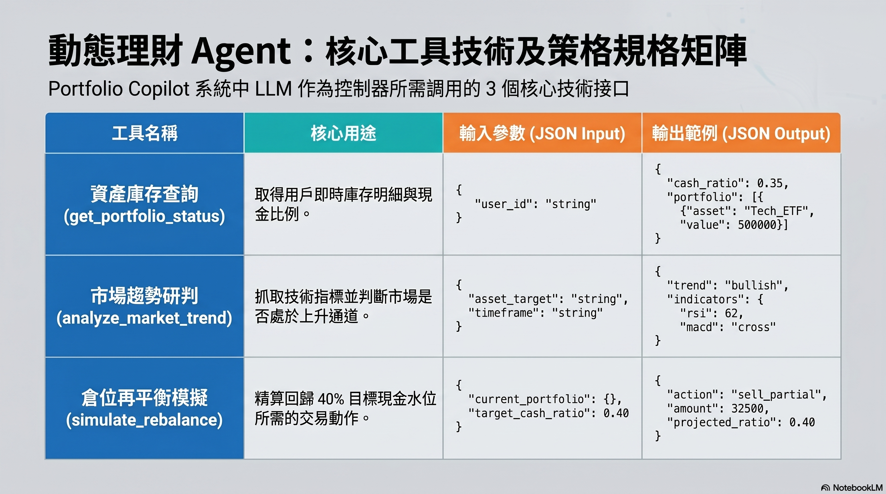

# 📊 Portfolio Copilot：基於 AI Harness 的動態理財與投資輔助 Agent

> **為個人投資者量身打造的「抗情緒、重紀律、智能調倉」助手。本系統基於先進的 AI Harness 編排架構，將大語言模型 (LLM) 定位為核心系統控制器，配合嚴謹的長期記憶紀律約束與確定性工具鏈，在多頭行情中最大化獲利波段，並在市場波動時堅守風險水位防線。**

[](#-系統架構)
[](#-系統架構)
[](#-核心設計理念)
[](#)

---

## 📱 產品視覺與控制台介面預覽 (Product Interface)

以下為 **Portfolio Copilot** 的智能控制台與動態理財 Agent 的系統操作介面示意圖。系統通過整合即時數據流、趨勢預測雷達與自動化部位平衡精算，為用戶提供一目了然且極具現代科技感的資產配置看板：


---

## 💡 核心設計理念與痛點解決方案

個人投資者在動態市場中常面臨兩大毀滅性的情緒偏差與執行難題：

1.  **「死板停利點」造成的利潤侵蝕 (The Rigid Take-Profit Trap)**
    傳統理財常設定固定的停利規則（例如：「淨利達 15,000 元即全數賣出」）。當標的資產（如 Tech_ETF）正處於強勢多頭主升段時，這種僵化的規則會迫使投資者過早離場下車，錯失後續翻倍的波段漲幅。
2.  **「資產再平衡」的紀律執行潰散 (The Discipline Execution Deficit)**
    在遭遇市場劇烈波動時，手動精算維持「40% 現金水位」的安全防線程序繁瑣。更糟糕的是，投資者常因貪婪在牛市頂部超額配置，或因恐懼在熊市底部割肉離場，導致預設的資產紀律在情緒干擾下名存實亡。

### AI Harness 的革新架構
**Portfolio Copilot** 徹底改變了這一切。我們不盲目相信 LLM 的價格預測，也不對 LLM 進行特定領域的模型微調（Fine-tuning）。相反，我們採用 **AI Harness** 設計哲學：
*   **LLM 作為系統控制器 (System Controller)**：僅負責解析用戶意圖、進行邏輯推理 (Thought) 與決策流編排。
*   **長期記憶作為憲法約束 (Memory constraints)**：將「現金水位 40%」等紀律參數固化在長期記憶 (Long-term Profile) 中，作為推理的最高憲法，不隨用戶當下的恐懼或貪婪情緒妥協。
*   **確定性任務交給專業工具 (Deterministic Tooling)**：將市場趨勢研判（技術指標）與倉位精算交給確定性的數學與程式庫引擎，杜絕 LLM 的數學計算幻覺。

---

## 🏗️ 系統架構深度解析

系統採用嚴謹的四模組設計，基於狀態機進行安全的資料流轉：


1.  **System Controller (LLM Core / 推理引擎)**
    系統的大腦，負責意圖解析與 ReAct（推理-行動-觀察）的多步驟編排。它根據當下的觀測狀態（Observation），判斷下一個最優步驟。
2.  **Orchestrator (編排器)**
    基於 **LangGraph** 思想設計的狀態機。管控 Agent 的生命週期，嚴格限定資料流向，確保系統在規定的步驟內收斂，杜絕無限循環與漂移。
3.  **雙層記憶體模組 (Memory Module)**
    *   **短期對話上下文 (Short-term Context)**：暫存當次對話 Session 的歷程與中間 Thought 推理步驟，提供自然的對話連貫性。
    *   **長期用戶投資指標 (Long-term Profile)**：存放硬性紀律限制（40% 現金目標水位）與歷史交易教訓，為 Controller 提供不可逾越的推理約束。
4.  **工具執行引擎 (Tool Engine)**
    負責外部 APIs 溝通，將獲取的實時股市行情、交易狀態與計算結果轉換為標準 JSON 格式回傳給 Controller。

---

## ⚙️ 核心工具規格鏈 (Tool Chain / API Specs)

系統內置了三個高可靠性的 Function Calling 技術接口：



### 1. get_portfolio_status (資產庫存盤點)
*   **用途**：取得用戶當前的即時資產持倉、庫存明細與現金水位比例。
*   **JSON Input**：
    ```json
    { "user_id": "string" }
    ```
*   **JSON Output**：
    ```json
    {
      "cash_ratio": 0.35,
      "portfolio": [
        { "asset": "Tech_ETF", "value": 500000 }
      ]
    }
    ```

### 2. analyze_market_trend (市場趨勢研判)
*   **用途**：抓取指定資產標的的即時技術指標（如 RSI, MACD, 均線通道），客觀研判是否處於強勢上升通道。
*   **JSON Input**：
    ```json
    {
      "asset_target": "string",
      "timeframe": "string"
    }
    ```
*   **JSON Output**：
    ```json
    {
      "trend": "bullish",
      "indicators": {
        "rsi": 62,
        "macd": "cross"
      }
    }
    ```

### 3. simulate_rebalance (倉位再平衡精算)
*   **用途**：精算若要回歸目標現金比例（如 40%），對當前持倉實施最小幅度、最優代價的交易動作。
*   **JSON Input**：
    ```json
    {
      "current_portfolio": {
        "cash_ratio": 0.35,
        "portfolio": [{"asset": "Tech_ETF", "value": 500000}]
      },
      "target_cash_ratio": 0.40
    }
    ```
*   **JSON Output**：
    ```json
    {
      "action": "sell_partial",
      "amount": 32500,
      "projected_ratio": 0.40
    }
    ```

---

## 🔄 ReAct 動態決策流程深度追蹤 (Workflow Trace)

下圖展示了僵化停利模式與 Portfolio Copilot 基於 ReAct 動態決策循環的邏輯差異：


### 決策流序列軌跡


---

## 📊 系統評估與回測框架 (Evaluation Metrics)

系統透過以下五個核心維度進行全方位的精準評估，確保控制器的決策品質與紀律執行：


1.  **工具呼叫準確率 (Tool Calling Accuracy)**：評估 LLM 控制器是否能在正確步驟精準調用 API，且 JSON 參數帶入完全無誤。
2.  **編排邏輯完整度 (Orchestration Integrity)**：驗證 ReAct 決策循環是否完整收斂，從發現現金不足到部位精算，邏輯鏈路嚴密。
3.  **對話上下文連貫性 (Context Consistency)**：檢驗雙層記憶體（短期對話與長期用戶 Profile）的整合檢索能力，確保決策在多次交互中仍符合長期方針。
4.  **紀律執行率 (Discipline Execution Rate)**：衡量系統在長對話任務中，是否能成功引導並強制執行「40% 現金水位」的核心紀律，有效克服人性弱點。
5.  **決策品質回測 (Backtesting Quality)**：導入歷史真實行情數據，驗證「Agent 動態趨勢決策」在年化報酬率與最大回撤（MDD）上是否優於「傳統固定停利機制」。

---

## 🚀 快速啟動 (模擬運行)

本專案提供基於 Python 偽實作的狀態編排範例。

### 安裝依賴
```bash
pip install openai langgraph pydantic
```

### 模擬 Agent 運行
您可以參考以下核心邏輯啟動您的 Portfolio Agent 決策模擬：

```python
from pydantic import BaseModel
from typing import List, Dict, Any

# 1. 定義資料結構
class PortfolioState(BaseModel):
    user_id: str
    messages: List[Dict[str, str]] = []
    current_cash_ratio: float = 0.0
    target_cash_ratio: float = 0.40
    market_trend: str = "unknown"
    action_plan: Dict[str, Any] = {}

# 2. 模擬工具定義
def get_portfolio_status(user_id: str) -> Dict[str, Any]:
    return {"cash_ratio": 0.35, "portfolio": [{"asset": "Tech_ETF", "value": 500000}]}

def analyze_market_trend(asset: str) -> Dict[str, Any]:
    return {"trend": "bullish", "strength": 85}

def simulate_rebalance(current_portfolio: Dict, target_ratio: float) -> Dict[str, Any]:
    return {"action": "sell_partial", "amount": 32500, "projected_ratio": 0.40}

# 3. 系統編排節點 (Orchestrator Node)
def agent_decision_flow(state: PortfolioState):
    # 第一步：資產盤點
    status = get_portfolio_status(state.user_id)
    state.current_cash_ratio = status["cash_ratio"]
    
    # 第二步：趨勢研判 (當發現現金不足時)
    if state.current_cash_ratio < state.target_cash_ratio:
        trend_result = analyze_market_trend("Tech_ETF")
        state.market_trend = trend_result["trend"]
        
        # 第三步：倉位再平衡模擬
        if state.market_trend == "bullish":
            state.action_plan = simulate_rebalance(status, state.target_cash_ratio)
            
    return state

# 執行流程
if __name__ == "__main__":
    initial_state = PortfolioState(user_id="user_jack_99")
    final_state = agent_decision_flow(initial_state)
    
    print("--- Portfolio Copilot 決策結果 ---")
    print(f"目前現金比例: {final_state.current_cash_ratio * 100}% (目標: {final_state.target_cash_ratio * 100}%)")
    print(f"標的市場趨勢: {final_state.market_trend.upper()}")
    print(f"建議執行動作: {final_state.action_plan}")
```
