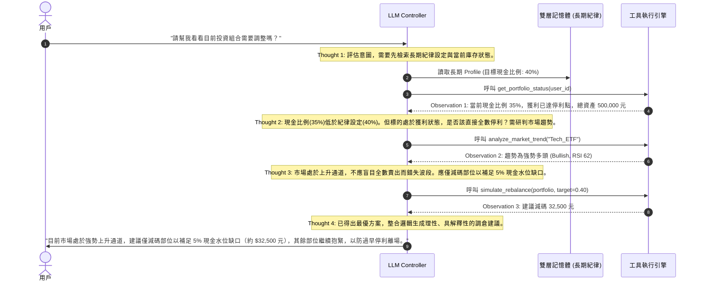

# 📊 Portfolio Copilot：動態理財與投資輔助 Agent

> **基於 AI Harness 架構的「動態理財與紀律控管助手」，透過 LLM 作為系統控制器，在硬性長期記憶約束下實現理性投資、動態再平衡與抗情緒波動的紀律管理。**

[](#-系統架構)
[](#-系統架構)
[](#-核心設計理念)

---

## 💡 核心設計理念

傳統個人投資者在面對動態市場時，常面臨兩大核心痛點：
1. **死板停利點造成的利潤侵蝕**：設定固定的停利點（例如淨利達 1.5 萬即賣出），導致在多頭行情（Bull Run）中過早停利離場，錯失主升段。
2. **紀律執行的情緒波動**：難以精準維持「40% 現金水位」的風險防線，手動進行資產再平衡（Rebalance）繁瑣且極易受人性貪婪與恐懼的干擾。

**Portfolio Copilot** 採用 **AI Harness** 設計模式，不進行繁瑣的模型微調（Fine-tuning），而是將 LLM 定位為 **「系統控制器 (System Controller)」**。透過外部工具呼叫（Function Calling）獲取實時市場趨勢與資產狀態，並在 **「長期記憶模組」** 的硬性投資紀律約束下，精算補足現金缺口的最小代價，提供具備高度邏輯可解釋性的動態調倉決策。

---

## 🏗️ 系統架構

系統採用四大核心模組，以編排器為骨幹進行狀態流轉：


1. **System Controller (LLM Core)**：系統中央大腦，負責意圖解析、邏輯推理（Thought）、ReAct 決策，並下達精準的工具調用指令。
2. **Orchestrator (編排器)**：基於 LangGraph 思想的狀態機，管控 Agent 執行的完整生命週期，嚴格限制資料流向，確保系統的穩定性與收斂性。
3. **雙層記憶體模組 (Memory Module)**：
   * **短期對話上下文 (Short-term Context)**：管理當次對話 Session 的歷程與中間推理步驟。
   * **長期用戶投資指標 (Long-term Profile)**：存放硬性紀律（如：40% 現金水位）與歷史交易教訓，作為 LLM 決策時的「憲法約束」。
4. **工具執行引擎 (Tool Engine)**：負責與外部 API 連接，並將回傳數據轉換為標準 JSON 格式供 LLM 進行 Observation 研判。

---

## ⚙️ 核心工具矩陣 (Tool Chain)

系統定義了三個核心技術接口（Function Calling APIs），提供實時數據支持：


### 1. 查詢資產狀態 (`get_portfolio_status`)
* **用途**：查詢用戶當前的即時庫存明細與現金比例。
* **輸入參數 (JSON Input)**：
  ```json
  { "user_id": "string" }
  ```
* **輸出範例 (JSON Output)**：
  ```json
  {
    "cash_ratio": 0.35,
    "portfolio": [
      { "asset": "Tech_ETF", "value": 500000 }
    ]
  }
  ```

### 2. 市場趨勢研判 (`analyze_market_trend`)
* **用途**：抓取特定標的之技術指標（如 RSI, MACD），判斷是否處於強勢上升通道。
* **輸入參數 (JSON Input)**：
  ```json
  {
    "asset_target": "string",
    "timeframe": "string"
  }
  ```
* **輸出範例 (JSON Output)**：
  ```json
  {
    "trend": "bullish",
    "indicators": {
      "rsi": 62,
      "macd": "cross"
    }
  }
  ```

### 3. 倉位再平衡模擬 (`simulate_rebalance`)
* **用途**：精算若要回歸目標現金水位（如 40%），最少且最具效益的交易動作。
* **輸入參數 (JSON Input)**：
  ```json
  {
    "current_portfolio": {},
    "target_cash_ratio": 0.40
  }
  ```
* **輸出範例 (JSON Output)**：
  ```json
  {
    "action": "sell_partial",
    "amount": 32500,
    "projected_ratio": 0.40
  }
  ```

---

## 🔄 ReAct 動態決策流程


相較於傳統模式「獲利超過 1.5 萬即全數賣出」的僵化策略，Portfolio Copilot 遵循 **ReAct (Thought -> Action -> Observation)** 的循環邏輯：



---

## 📊 系統評估指標

系統透過以下五個核心維度進行全方位的精準評估，確保控制器的決策品質與紀律執行：


1. **工具呼叫準確率 (Tool Calling Accuracy)**：評估 LLM 是否能在正確步驟精準呼叫對應的 API，且 JSON 參數完全無誤。
2. **紀律執行率 (Discipline Execution Rate)**：衡量系統在長期對話或高波動市場中，是否能成功引導並強制執行「40% 現金水位」的核心紀律。
3. **決策品質回測 (Backtesting Quality)**：導入歷史真實行情數據，驗證「Agent 動態趨勢決策」在年化報酬率與最大回撤（MDD）上是否優於「傳統固定停利機制」。
4. **編排邏輯完整度 (Orchestration Integrity)**：驗證 ReAct 決策循環是否完整，從市場研判到部位精算的邏輯鏈結是否嚴密無遺漏。
5. **對話上下文連貫性 (Context Consistency)**：檢驗雙層記憶體（短期對話與長期用戶 Profile）的整合能力，確保決策在多次交互中仍符合長期方針。

---

## 🚀 快速啟動 (模擬運行)

本專案提供基於 Python 偽實作的狀態編排範例。

### 安裝依賴
```bash
pip install openai langgraph pydantic
```

### 模擬 Agent 運行
您可以參考以下核心邏輯啟動您的 Portfolio Agent 決策模擬：

```python
from pydantic import BaseModel
from typing import List, Dict, Any

# 1. 定義資料結構
class PortfolioState(BaseModel):
    user_id: str
    messages: List[Dict[str, str]] = []
    current_cash_ratio: float = 0.0
    target_cash_ratio: float = 0.40
    market_trend: str = "unknown"
    action_plan: Dict[str, Any] = {}

# 2. 模擬工具定義
def get_portfolio_status(user_id: str) -> Dict[str, Any]:
    return {"cash_ratio": 0.35, "portfolio": [{"asset": "Tech_ETF", "value": 500000}]}

def analyze_market_trend(asset: str) -> Dict[str, Any]:
    return {"trend": "bullish", "strength": 85}

def simulate_rebalance(current_portfolio: Dict, target_ratio: float) -> Dict[str, Any]:
    return {"action": "sell_partial", "amount": 32500, "projected_ratio": 0.40}

# 3. 系統編排節點 (Orchestrator Node)
def agent_decision_flow(state: PortfolioState):
    # 第一步：資產盤點
    status = get_portfolio_status(state.user_id)
    state.current_cash_ratio = status["cash_ratio"]
    
    # 第二步：趨勢研判 (當發現現金不足時)
    if state.current_cash_ratio < state.target_cash_ratio:
        trend_result = analyze_market_trend("Tech_ETF")
        state.market_trend = trend_result["trend"]
        
        # 第三步：倉位再平衡模擬
        if state.market_trend == "bullish":
            state.action_plan = simulate_rebalance(status, state.target_cash_ratio)
            
    return state

# 執行流程
if __name__ == "__main__":
    initial_state = PortfolioState(user_id="user_jack_99")
    final_state = agent_decision_flow(initial_state)
    
    print("--- Portfolio Copilot 決策結果 ---")
    print(f"目前現金比例: {final_state.current_cash_ratio * 100}% (目標: {final_state.target_cash_ratio * 100}%)")
    print(f"標的市場趨勢: {final_state.market_trend.upper()}")
    print(f"建議執行動作: {final_state.action_plan}")
```
