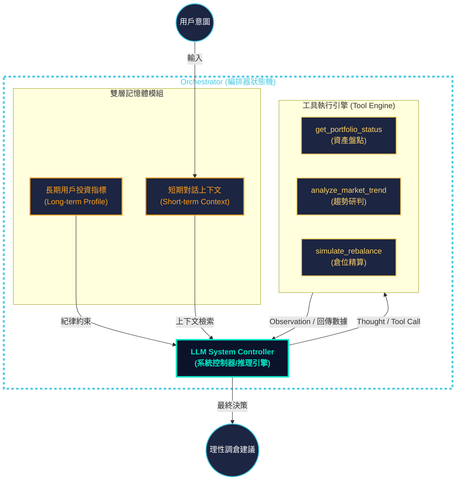
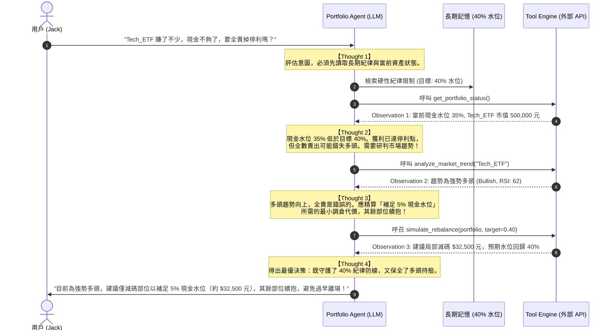

# 🎨 Portfolio Copilot：資訊圖表設計藍圖與視覺元素描述

本文件為 **Portfolio Copilot (動態理財與投資輔助 Agent)** 的資訊圖表（Infographic）設計藍圖。本規劃旨在指導設計師或透過前端網頁技術（如 React/Vue + TailwindCSS + Canvas/SVG）將本系統之精髓以極具現代感、科技感與專業度的視覺方式呈現。

---

## 1. 視覺設計系統 (Visual Design System)

為了給用戶帶來「可信賴、具備智慧感、沉穩且富有科技感」的視覺衝擊，本圖表建議採用 **暗色調玻璃擬態（Glassmorphism Dark Theme）** 風格。

### 1.1 配色方案 (Color Palette)
*   **背景主色 (Background)**: 
    *   深邃藍黑 (`#0B132B`): 代表金融市場的深度與穩健。
    *   極致暗夜 (`#1C2541`): 作為卡片或容器的底色。
*   **科技輔助色 (Teal & Cyan)**:
    *   極光綠 (`#00E8C6`): 用於「多頭趨勢 (Bullish)」、「資產增加」與核心高亮提示。
    *   電光藍 (`#48CAE4`): 代表數據流、API 調用與系統編排器。
*   **警告與黃金對比色 (Amber & Coral)**:
    *   珊瑚橘 (`#FF9F1C`): 用於「現金比例不足」、「警報」或「長期紀律約束」。
    *   初陽黃 (`#FFD166`): 用於決策中的中間「思考 (Thought)」與精算建議。
*   **文字與細節色 (Typography & Detail)**:
    *   極地白 (`#F8F9FA`): 主標題與關鍵數據。
    *   石板灰 (`#8D99AE`): 說明文字與靜態標籤。

### 1.2 字體系統 (Typography)
*   **英數字體**: 使用 `Outfit` 或 `Montserrat`，具備現代感的無襯線字體，展現科技洗鍊感。
*   **中文字體**: 使用 `Inter` 搭配 `微軟正黑體 (Microsoft JhengHei)` 或 `Noto Sans TC`，字體粗細分明，提升可讀性。

---

## 2. 圖表排版結構與版面佈局 (Grid Layout)

資訊圖表採用 **長卷圖 (Infographic Scroll)** 或 **2x2 矩陣看板 (Dashboard Grid)** 排版，自上而下劃分為五大視覺區塊（Sections）：

```
+-------------------------------------------------------------+
|               SECTION 1: 視覺英雄區 (Hero Header)            |
|               標題：Portfolio Copilot 動態理財 Agent         |
+-------------------------------------------------------------+
|        SECTION 2: 系統架構模組         |  SECTION 3: 核心工具矩陣    |
|        (4 大組件與數據流向)            |  (3 大 API 輸入輸出規格)     |
+-------------------------------------------------------------+
|               SECTION 4: ReAct 多步驟決策動態循環流           |
|               (調查水位 -> 研判趨勢 -> 精算建議)             |
+-------------------------------------------------------------+
|               SECTION 5: 五維系統評估指標與回測對比           |
|               (五維雷達圖 + 傳統 vs Agent 回測指標)           |
+-------------------------------------------------------------+
```

---

## 3. 各區塊視覺元素與圖表描述 (Section Details)

### 3.1 Section 1: 視覺英雄區 (Hero Header)
*   **視覺設計**：
    *   左側配置一個發光的 **3D 晶片腦部與錢包結合的標誌（Logo）**，周圍環繞著綠色與橘色的數據光環。
    *   右側為漸層字體的主標題：「**Portfolio Copilot：動態理財與投資輔助 Agent**」。
    *   下方標註一句醒目的 Slogan：「*以 LLM 為系統控制器，以長期記憶為憲法紀律，克服人性貪婪與恐懼。*」

### 3.2 Section 2: 系統架構全景區
*   **視覺設計**：
    *   展示一個包含四個發光半透明玻璃容器的 **系統架構圖**。
    *   **Orchestrator (編排器)** 作為一個巨大的藍色外框，將所有組件包覆其中。
    *   **雙層記憶體模組** 位於左側，分為橘色的「長期記憶 (Long-term)」與黃色的「短期對話 (Short-term)」，有數據箭頭流向中央的 **LLM System Controller (中央大腦)**。
    *   大腦右側有雙向紫色光流，連接到右側的 **Tool Engine (工具執行引擎)**，其內部包含三個 API 圖示。

#### Mermaid.js 架構圖代碼：


### 3.3 Section 3: 核心工具技術規格矩陣
*   **視覺設計**：
    *   以極具現代感的 **「規格矩陣網格 (Grid Matrix)」** 呈現。
    *   每個工具佔據一個卡片，卡片邊框分別為電光藍、極光綠和珊瑚橘。
    *   卡片頂部有對應的 API 名稱與小圖示，內部以高對比度的程式碼高亮（Monokai/Dracula風格）展示 **JSON Input** 與 **JSON Output**。

### 3.4 Section 4: ReAct 多步驟決策動態循環流
*   **視覺設計**：
    *   此區塊是圖表的靈魂。採用 **時間軸 (Timeline)** 與 **雙環流 (Double Loop)** 的動態路徑展示。
    *   左側展示傳統死板停利機制的「線性墜落圖」（獲利達1.5萬 ➔ 賣出 ➔ 錯失後續波段，呈現紅色警告線）。
    *   右側展示 Agent 的三個循環圈（Step 1 ➔ Step 2 ➔ Step 3），每個圈都清楚標示 `Thought`、`Action` 與 `Observation`，以綠色與黃色的漸層發光箭頭相連，並伴隨工具圖示，最終匯聚成發光的 `Final Answer`。

#### Mermaid.js ReAct 工作流序列圖代碼：


### 3.5 Section 5: 五維系統評估指標與回測對比
*   **視覺設計**：
    *   左側放置一個 **五維發光雷達圖（Radar Chart）**。五個頂角分別為：工具呼叫準確度、編排邏輯完整度、對話上下文連貫性、紀律執行率、決策品質回測。圖表中心有一個充實的綠色發光多邊形，顯示 Agent 的卓越表現。
    *   右側放置一個 **「傳統模式 vs Agent 決策」之量化對比柱狀圖**。
        *   **年化報酬率 (CAGR)**：Agent (綠色高柱) vs 傳統停利 (灰色矮柱)。
        *   **最大回撤 (MDD)**：Agent (較短的紅色柱，代表風險低) vs 傳統停利 (較長的灰色柱)。
        *   **夏普比率 (Sharpe)**：Agent (綠色高柱) vs 傳統停利 (灰色矮柱)。

---

## 4. 資訊圖表設計細節與動效建議 (UX & Interactions)

若本資訊圖表以 **Web 互動網頁** 方式呈現，建議加入以下微動效：
1.  **數據流微光動畫**：當用戶將滑鼠懸停在「Orchestrator」上時，連接記憶體與大腦、大腦與工具內部的線條會產生由左至右流動的微光特效。
2.  **ReAct 步進高亮**：點擊 Section 4 工作流中的 Step 1、2、3，會像播放幻燈片一樣，以亮燈方式動態呈現對應的 `Thought` 與 `Action`。
3.  **雷達圖動態展開**：當網頁向下捲動到 Section 5 時，五維雷達圖的綠色覆蓋區域會從中心原點以彈性動畫（Bounce Animation）向外擴散展開，營造出視覺的精緻感與衝擊力。
