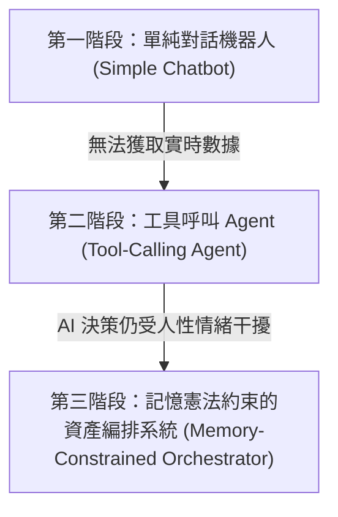

# 📊 Portfolio Copilot：動態理財與投資輔助 Agent 系統設計與評估報告

---

## 1. 專案背景與痛點深挖 (Problem & Scenario)

### 1.1 個人投資理財的核心痛點
在當前波譎雲詭的全球金融市場中，個人投資者（Retail Investors）常面臨資產配置與風險控管的雙重挑戰。儘管「資產配置」與「紀律控管」被公認為長期獲利的關鍵，但在實際操作中，人性弱點常導致投資決策偏差。本系統主要針對以下兩大核心痛點進行攻堅：

1. **僵化停利（Rigid Profit-Taking）導致的利潤縮水**
   傳統投資顧問或個人常設定「死板停利點」（例如：淨獲利達 15,000 元即全數賣出）。這種做法忽視了市場當前的強勢動能。在多頭行情（Bull Run）中，僵化停利會導致投資者過早下車，錯失後續數倍的波段漲幅。
2. **資產再平衡（Rebalance）的紀律執行困難**
   維持穩健的風險防線（如「40% 現金水位」）是應對市場暴跌的關鍵。然而，手動精算調倉比例程序繁瑣，且投資者在面對市場誘惑時，常因貪婪而超額配置高風險資產；在市場恐慌時，又因恐懼不敢逢低吸納，導致預設的資產配置纪律名存實亡。

### 1.2 AI Harness 的創新解決方案
為解決上述痛點，**Portfolio Copilot** 摒棄了傳統盲目預測股價的 AI 模式，採用 **AI Harness** 設計框架。我們不對 LLM 進行特定領域的模型訓練（Fine-tuning），而是將其定位為 **「系統控制器 (System Controller)」**。
LLM 不直接給出投資建議，而是扮演大腦角色，通過 **工具呼叫 (Function Calling)** 實時獲取外部市場趨勢與用戶資產配置，並置於 **「長期記憶模組」** 的硬性投資紀律憲法約束下，精算補足現金缺口的最小代價，提供具備高度邏輯可解釋性的動態調倉決策。

### 1.3 決策邏輯大對比：傳統模式 vs. AI Harness
下圖展示了傳統僵化停利模式與 Portfolio Copilot 基於 ReAct 動態決策循環的邏輯差異：


*   **傳統模式**：執行簡單的僵化流程，獲利大於 1.5 萬即全數賣出，缺乏市場趨勢研判，極易在強勢波段中過早離場，造成巨大的機會成本。
*   **AI Harness 模式**：採用 ReAct (Thought -> Action -> Observation) 多步驟動態循環，依次進行「調查水位」、「研判趨勢」、「精算建議」，做出可解釋的理性建議，精準維持資產紀律。

---

## 2. AI Harness 系統架構設計 (System Architecture)

本系統基於 AI Harness 模式構建，將大語言模型的邏輯推理能力與工程化的狀態管控相結合，其架構全景圖如下所示：


系統由以下四大核心模組協作構成：

### 2.1 LLM 系統控制器 (LLM System Controller / 推理引擎)
系統的中央大腦。負責：
*   **意圖解析**：識別用戶輸入的理財意圖與情感狀態。
*   **ReAct 決策推理**：依據 `Thought -> Action -> Observation` 的邏輯鏈條，逐步拆解複雜的再平衡任務。
*   **工具指令生成**：精準生成 Function Calling 所需的 JSON 格式參數，並解讀工具回傳的 Observation 觀測結果。

### 2.2 編排器 (Orchestrator)
採用類似 **LangGraph** 的狀態機架構，是系統的安全防線與骨幹。
*   **狀態流轉管控**：嚴格管理 Agent 的生命週期，定義明確的 Node（節點）與 Edge（邊）。
*   **資料流約束**：嚴格限制 LLM 與外部工具、記憶體之間的資料流向，防止 AI 脫軌或陷入死循環，確保系統輸出的收斂性與穩定性。

### 2.3 雙層記憶體模組 (Memory Module)
*   **短期對話上下文 (Short-term Context)**：暫存當次對話 Session 的對話歷史、LLM 的中間 Thought 推理步驟以及工具調用日誌，確保上下文理解的連貫性。
*   **長期用戶投資指標 (Long-term Profile)**：存放用戶的「硬性紀律設定」（例如：現金水位必須維持在 40%）、用戶風險偏好以及歷史交易教訓。這部分作為 LLM 推理時的 **「硬性先驗約束」**，不隨對話輕易變動，強迫 AI 克服人類的情緒波動。

### 2.4 工具執行引擎 (Tool Engine)
作為系統與現實金融世界的橋樑。
*   **API 封裝**：封裝證券商接口、實時行情 API 以及數學計算引擎。
*   **資料轉換**：將底層複雜的數據源統一清洗、轉換為結構化的 JSON 格式，回傳給系統控制器。

---

## 3. 核心工具鏈技術與策略規格矩陣 (Tool Chain Specs)

為了支持系統控制器的決策，系統定義了 3 個核心技術接口（APIs）。規格矩陣如下表所示：


### 3.1 核心 API 詳細規格

#### 1. 查詢資產狀態 (`get_portfolio_status`)
*   **功能描述**：取得用戶即時庫存明細與現金比例，用於評估是否偏離紀律設定。
*   **輸入參數說明**：
    ```json
    {
      "user_id": "string" // 用戶唯一識別碼，用於後端資料檢索
    }
    ```
*   **輸出範例**：
    ```json
    {
      "cash_ratio": 0.35,
      "portfolio": [
        {
          "asset": "Tech_ETF",
          "value": 500000
        }
      ]
    }
    ```

#### 2. 市場趨勢研判 (`analyze_market_trend`)
*   **功能描述**：抓取指定資產標的的技術指標（如 RSI、MACD、均線通道等），客觀判斷其是否處於上升通道。
*   **輸入參數說明**：
    ```json
    {
      "asset_target": "string", // 資產標的代號 (例如: "Tech_ETF")
      "timeframe": "string"     // 時間維度 (例如: "1d", "1w")
    }
    ```
*   **輸出範例**：
    ```json
    {
      "trend": "bullish", // 市場趨勢: bullish (多頭) / bearish (空頭) / sideways (震盪)
      "indicators": {
        "rsi": 62,
        "macd": "cross"
      }
    }
    ```

#### 3. 倉位再平衡模擬 (`simulate_rebalance`)
*   **功能描述**：精算回歸目標現金水位（如 40%）所需要的具體交易動作，提供最小代價的調倉路徑。
*   **輸入參數說明**：
    ```json
    {
      "current_portfolio": {
        "cash_ratio": 0.35,
        "portfolio": [{"asset": "Tech_ETF", "value": 500000}]
      },
      "target_cash_ratio": 0.40 // 目標現金水位比例
    }
    ```
*   **輸出範例**：
    ```json
    {
      "action": "sell_partial",      // 建議動作: sell_partial (部分減碼) / buy_more (補倉)
      "amount": 32500,               // 交易金額大小 (TWD)
      "projected_ratio": 0.40        // 預估調整後的現金水位
    }
    ```

---

## 4. 多步驟 Agent 工作流深度追蹤 (ReAct Workflow Trace)

本節以一個真實的調倉場景，展示 Portfolio Copilot 的決策路徑。

### 4.1 觸發場景
*   **用戶基本狀態**：長期記憶設定目標現金水位為 **40%**。
*   **當前資產現況**：因標的資產上漲，導致現金比例下降至 **35%**，獲利已達到傳統的固定停利門檻。
*   **用戶輸入**：*「我的 Tech_ETF 最近賺了不少，目前現金水位好像不太夠，我該全部賣掉停利來補足現金嗎？」*

### 4.2 系統決策軌跡 (Trace Logs)

*   **Step 1: 調查水位 (Status Check)**
    *   **Thought 1**: 用戶詢問是否需要調整部位。我需要首先調閱用戶當前的實時資產狀態，以及長期 Profile 中的紀律規則。
    *   **Action 1**: 呼叫 `get_portfolio_status`，參數為 `{"user_id": "jack_99"}`。
    *   **Observation 1**: 返回當前現金水位為 35%，Tech_ETF 市值為 500,000 元。對比長期記憶，目標現金水位應為 40%，當前現金水位不足 5%。

*   **Step 2: 研判趨勢 (Trend Analysis)**
    *   **Thought 2**: 用戶現金不足 5% 觸發了再平衡警報。然而，用戶提出是否要「全數賣出停利」。如果盲目全數賣出，可能會錯失後續多頭波段。我必須借助外部工具，研判 Tech_ETF 目前的技術趨勢是否處於上升通道。
    *   **Action 2**: 呼叫 `analyze_market_trend`，參數為 `{"asset_target": "Tech_ETF", "timeframe": "1d"}`。
    *   **Observation 2**: 返回 `{"trend": "bullish", "indicators": {"rsi": 62, "macd": "cross"}}`。顯示市場正處於強勢上升通道。

*   **Step 3: 精算再平衡建議 (Rebalance Simulation)**
    *   **Thought 3**: 研判顯示 Tech_ETF 處於多頭通道中，此時全數賣出極不理智。為了在「防守紀律（40% 現金水位）」與「進攻獲利（續抱上升波段）」之間取得完美平衡，我應僅精算「補足 5% 現金缺口的最小減碼部位」，而非全數賣出。
    *   **Action 3**: 呼叫 `simulate_rebalance`，參數為 `{"current_portfolio": {"cash_ratio": 0.35, "portfolio": [{"asset": "Tech_ETF", "value": 500000}]}, "target_cash_ratio": 0.40}`。
    *   **Observation 3**: 返回 `{"action": "sell_partial", "amount": 32500, "projected_ratio": 0.40}`。

*   **Step 4: 生成具可解釋性的理性決策 (Final Answer)**
    *   **Thought 4**: 所有數據與運算已就緒。Tech_ETF 處於強勢上漲軌道，若全數賣出將錯失波段。最優方案是僅「微調 5% 現金水位」，也就是局部減碼 32,500 元，將現金比率拉回 40%，其餘資產續抱。這既維持了投資紀律，又保留了多頭獲利空間。
    *   **Final Answer**:
        > 「您好！根據系統盤點，您目前現金水位為 35%，距離長期設定的 40% 風險紀律防線缺口為 5%。
        > 
        > 透過即時技術指標研判，您的核心持股 **Tech_ETF** 目前正處於 **強勢上升通道 (Bullish)**。為了避免過早停利而錯失多頭波段，**強烈建議您不要採取『全數賣出』的極端作法**。
        > 
        > 系統精算最佳方案為：**僅局部減碼 Tech_ETF 約 $32,500 元**以補足 5% 的現金缺口，其餘部位繼續穩健續抱。這將在精準守護 40% 風險防線的同時，最大限度保留您在多頭行情中的獲利潛力。」

---

## 5. 系統評估與回測框架 (Evaluation)

為確保 Portfolio Copilot 控制器的決策品質、邏輯嚴密性與紀律執行力，我們建立了全方位的「五維系統評估指標」框架：


### 5.1 五大評估維度

1.  **工具呼叫準確率 (Tool Calling Accuracy)**
    *   **評估目標**：測試 LLM 作為控制器時，是否能在正確的推理步驟選對 API，且 JSON 參數傳入 100% 正確（無語法缺失、類型錯誤或幻覺參數）。
    *   **指標公式**：$\text{準確率} = \frac{\text{正確呼叫且參數無誤的 Tool 數}}{\text{總 Tool 呼叫次數}} \times 100\%$。
2.  **編排邏輯完整度 (Orchestration Integrity)**
    *   **評估目標**：驗證 ReAct 流程中「思考-行動-觀察」的循環是否完整收斂。特別是從「發現現金不足」➔「市場趨勢研判」➔「調倉精算」的邏輯鏈結是否嚴密，有無跳步或死循環現象。
3.  **對話上下文連貫性 (Context Consistency)**
    *   **評估目標**：檢驗雙層記憶體（短期對話與長期用戶 Profile）的整合與檢索能力。在多次對話交互或受到用戶情感干擾（如用戶極度焦慮）時，決策是否依然能緊扣長期設定。
4.  **紀律執行率 (Discipline Execution Rate)**
    *   **評估目標**：衡量系統在長對話任務中，是否能成功引導並「強制」使用者維持 40% 的核心現金水位紀律，有效克服投資者的貪婪與恐懼。
5.  **決策品質回測 (Backtesting Quality)**
    *   **評估目標**：將 Agent 的動態調倉建議導入歷史真實行情數據進行量化回測。
    *   **核心對比指標**：
        *   **年化報酬率 (CAGR)**
        *   **最大回撤 (Maximum Drawdown, MDD)**
        *   **夏普比率 (Sharpe Ratio)**
    *   **對比基準 (Benchmark)**：將「Agent 動態趨勢決策」與「傳統固定停利機制（如獲利超過 15,000 元即賣出）」進行對比，驗證 Agent 的超額收益與風險控制表現。

---

## 6. 設計決策紀錄與迭代歷程 (Design Decisions for log.md)

在研發 Portfolio Copilot 的過程中，研發團隊經歷了多次架構重構。以下為記錄於 `log.md` 中的核心設計決策與迭代歷程：

### 6.1 系統架構的三階段演進

*   **第一階段 (Simple Chatbot)**：最初設計為一個簡單的對話機器人，但 LLM 缺乏實時金融數據，且無法精準計算調倉比例，實用價值極低。
*   **第二階段 (Tool-Calling Agent)**：引入 Function Calling，使 AI 能夠調用資產與趨勢 API。然而，實驗發現當用戶表現出極度貪婪或恐慌時，LLM 容易受到對話上下文的情緒感染，從而給出妥協於人性的非理性建議。
*   **第三階段 (Memory-Constrained Orchestrator - 最終收斂)**：我們將系統升級為基於長期記憶約束的編排系統。將「現金水位 40%」等投資紀律固化在 **Long-term Profile（長期記憶）** 中，並透過 Orchestrator 進行狀態鎖定，使 LLM 作為控制器必須在「長期記憶憲法」的約束下進行推理，從而徹底克服情緒感染。

### 6.2 關鍵設計決策與考量

#### 決策一：將「現金水位控管」置於長期記憶 (Long-Term Profile)
*   **Rationale (設計考量)**：如果將投資紀律僅放在 Prompt 或短期記憶中，隨著對話增多，LLM 會因為注意力窗口（Attention Window）的稀釋或用戶的強烈主觀意志而遺忘或妥協。固化於長期記憶中，可使其作為推理的 **硬性過濾條件**。每次決策前，編排器強制注入該紀律約束，保證了決策的抗情緒干擾性。

#### 決策二：將「趨勢研判」與「部位精算」獨立為 Deterministic Tool，而非由 LLM 估算
*   **Rationale (設計考量)**：大語言模型天生存在「幻覺（Hallucination）」與「計算不精準」的缺陷。若讓 LLM 盲目猜测市場趨勢或進行複利計算，極易給出錯誤的數值。因此，我們遵循 AI Harness 核心哲學——**「將確定性任務交給確定性工具」**。
    *   將趨勢分析交給標準的技術指標計算庫（如 TA-Lib）。
    *   將倉位調整交給嚴謹的金融數學引擎。
    *   LLM 僅負責「解析意圖」與「邏輯編排」，極大提升了系統的可靠性。
